# Supernote Linker

#### Supernote Linker allows you to add links to your drawings from within your notes!

## Linking Drawing

### Initial Link Setup Tutorial

There are some extra steps needed when setting up a link for the first time. You will need to set `Supernote Linker` as
the default handler for its links, and you will need to grant file permissions so that it can open the drawing files.
Here is a detailed breakdown of how to set up your first link!

1. Select something that you wish to have link to a drawing and tap to create a link.
    
    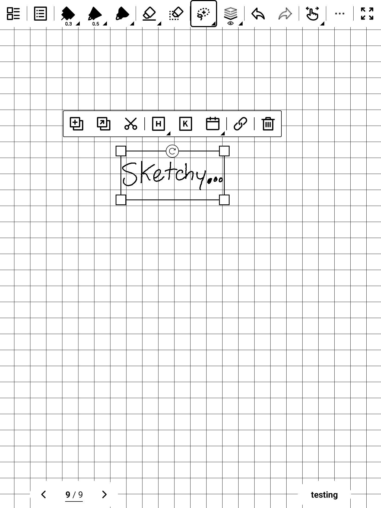

2. Choose `Web Page` from the list of `Link to` options.

    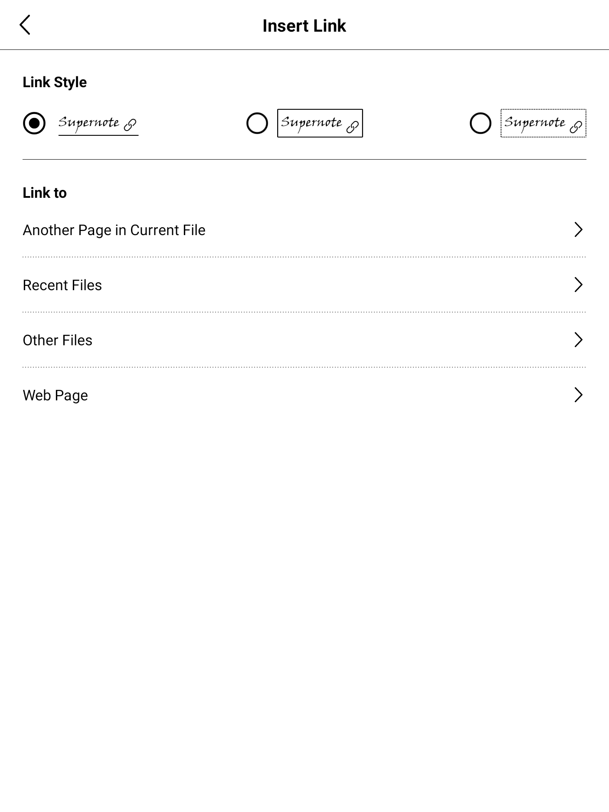

3. The box will already have `https://` entered. Just add `link/YOUR_CUSTOM_LINK_ID` to it. This link ID can have any
text you want in it. This link will be able to be reused if you wish to use it in other places as well, just use the
same link ID!

    

4. Here is an example: `https://link/sketch123`

    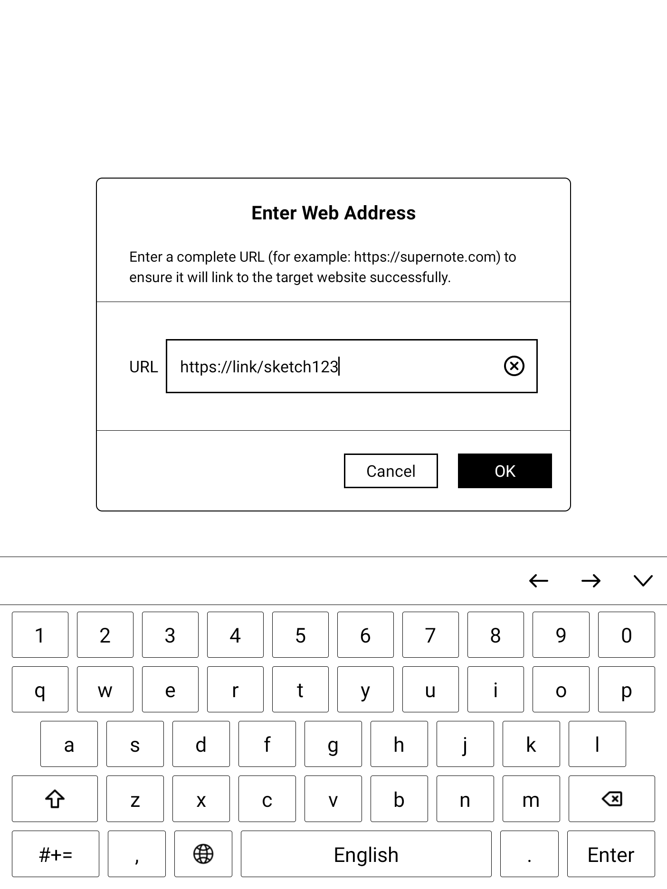

5. The link is now created, and you will be taken back to your note. Now tap on your newly created link. Choose to open
with `Supernote Linker` Always. You won't have to see this popup again. This tells Android to send all links that
start with `link/` to `Supernote Linker`. No real websites can ever start with this, so there are no conflicts with
your web browser.

    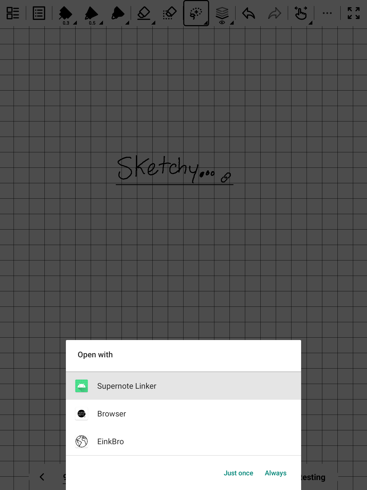

6. The first time you use `Supernote Linker`, you will need to grant file permissions. This is so that the app can
access the drawing files in order to open them. Tap `Grant Permission`.

    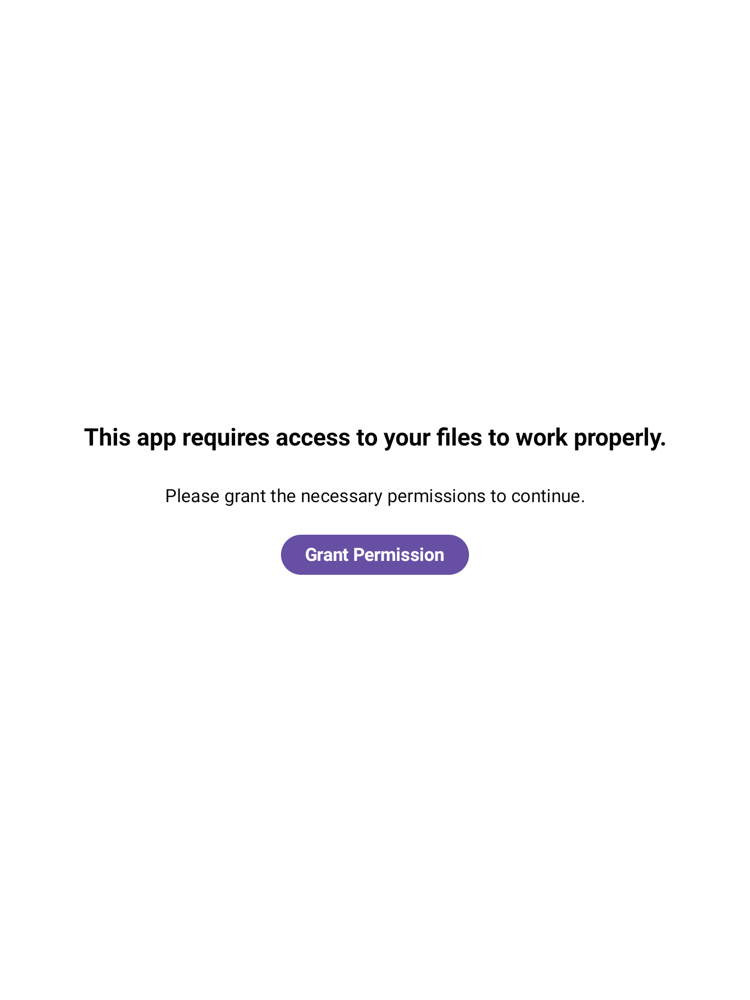

7. You will be taken to the Android settings page. Ensure that `Allow access to manage all files` is enabled, then
press the back button at the top. You will only need to do this once.

    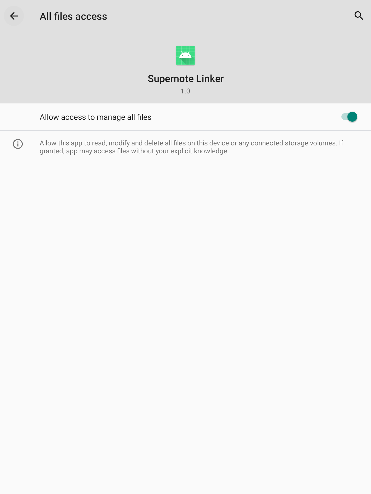

8. The file picker will now open. From now on, this will be the first screen you see when creating new links, as
permissions have now been granted.

    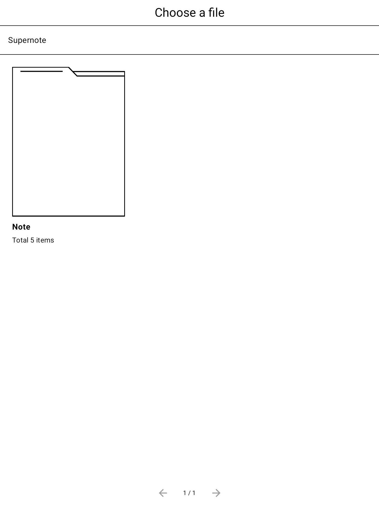

9. Select whichever drawing you want to link to. Only drawing files (and folders that contain drawing files) will be
shown.

    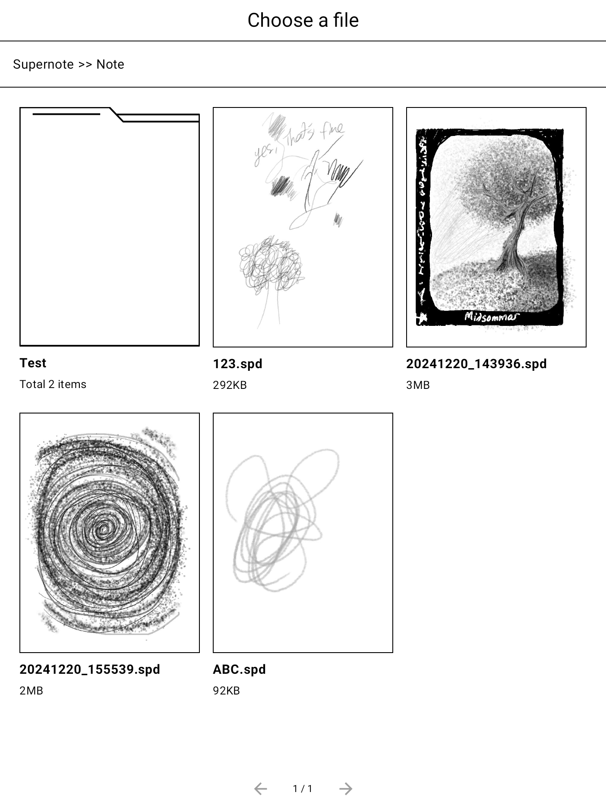

10. That's it! Now the link in your note file will open your drawing!

    

## Creating Popup Messages

Another feature of `Supernote Linker` is the ability to create a link that shows a popup message. To create a popup
link, do the following:
1. Create a link
2. Make the web address `https://popup/WHATEVER MESSAGE YOU WANT HERE!`

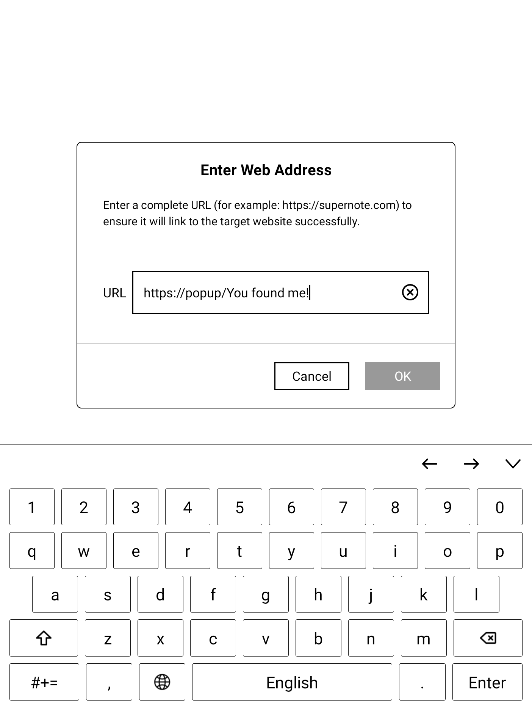
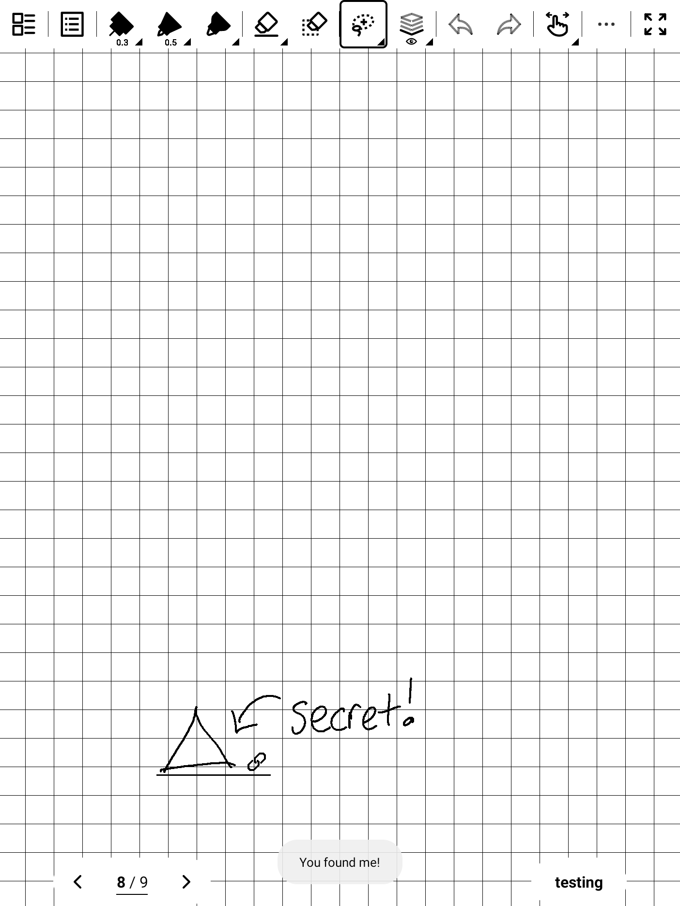

### In Action

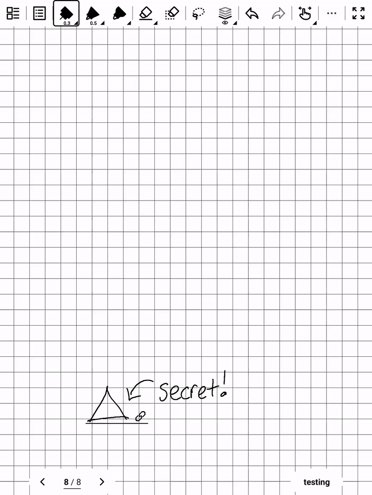
